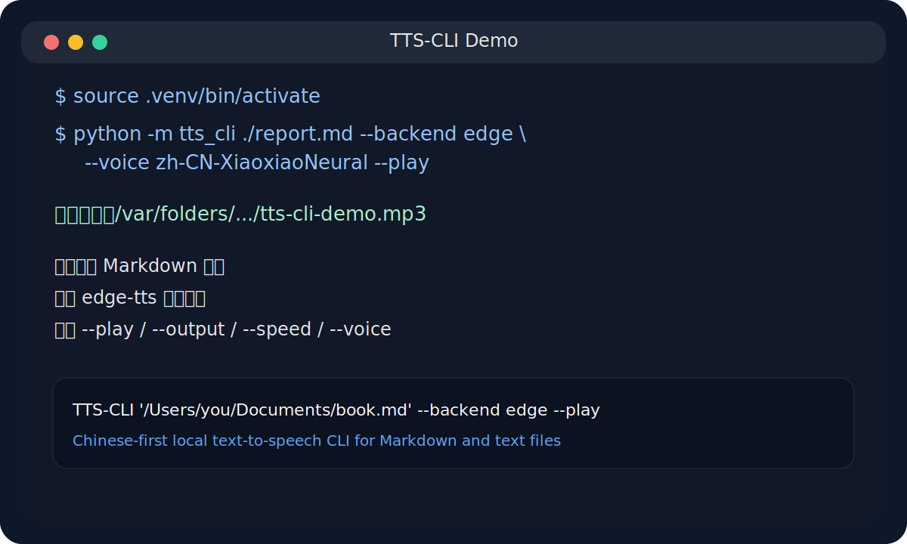

# TTS-CLI

[](https://github.com/changdaye/tts-cli/actions/workflows/ci.yml)

中文优先的本地文本转语音命令行工具。它可以直接读取你电脑上的 `.txt`、`.md`、`.markdown` 等文本文件，并通过免费 TTS 后端将文本朗读出来，或导出为音频文件。

This is a Chinese-first local text-to-speech CLI. It reads local text files such as `.txt` and `.md`, then speaks them aloud or exports them to audio using free TTS backends.

로컬 텍스트 파일을 직접 읽어 음성으로 변환하는 중국어 우선 TTS CLI 도구입니다. `.txt`, `.md`, `.markdown` 파일을 읽고 재생하거나 오디오 파일로 저장할 수 있습니다.



## 中文说明

### 项目简介

`TTS-CLI` 的目标很直接：

- 从本地文件路径读取文本
- 在终端中快速执行语音合成
- 优先支持免费方案
- 支持直接播放，也支持导出音频
- 通过简洁参数控制语速、语言、音色、音高等选项

当前支持两个后端：

- `edge-tts`：免费、在线、中文音色自然，推荐优先使用
- `pyttsx3`：免费、离线、本机朗读，适合无网络场景

### 功能特性

- 直接读取本地文本文件，例如 `TTS-CLI ./notes.md`
- 支持绝对路径与相对路径
- 支持 `--speed`、`--lang`、`--voice`、`--pitch`、`--style`
- 支持 `--output` 导出音频文件
- 支持 `--play` 生成后直接播放
- 支持 `--list-voices` 查看可用语音
- 命令输出和错误提示尽量使用中文

### 演示

README 首页附带了一张终端风格演示图，用于快速展示典型调用方式。如果后续你需要更真实的动画演示，可以再补录 GIF 或 asciinema。

### 项目结构

```text
tts-codex/
├── tts_cli/           # CLI 主逻辑
├── tests/             # 基础测试
├── TTS-CLI            # 直接执行入口
├── pyproject.toml     # 项目与依赖配置
├── README.md          # 项目文档
└── AGENTS.md          # 仓库协作说明
```

### 环境要求

- Python `3.10+`
- macOS 下 `--play` 默认使用系统自带 `afplay`
- 使用 `edge-tts` 时需要网络连接

### 安装方式

推荐先创建虚拟环境：

```bash
python3 -m venv .venv
source .venv/bin/activate
```

仅安装项目本体：

```bash
python3 -m pip install -e .
```

安装推荐的在线免费语音方案 `edge-tts`：

```bash
python3 -m pip install -e .
python3 -m pip install edge-tts
```

安装离线方案：

```bash
python3 -m pip install -e '.[offline]'
```

### 快速开始

直接朗读一个本地 Markdown 文件：

```bash
./TTS-CLI ./demo.md --backend edge --voice zh-CN-XiaoxiaoNeural --play
```

或者使用模块方式：

```bash
python -m tts_cli ./demo.md --backend edge --voice zh-CN-XiaoxiaoNeural --play
```

导出为 MP3：

```bash
python -m tts_cli ./demo.md --backend edge --voice zh-CN-XiaoxiaoNeural --output out.mp3
```

生成并立即播放：

```bash
python -m tts_cli ./demo.md --backend edge --voice zh-CN-XiaoxiaoNeural --output out.mp3 --play
```

### 命令参数

| 参数 | 说明 |
| --- | --- |
| `file` | 要读取的本地文本文件 |
| `--backend` | 后端类型：`auto`、`pyttsx3`、`edge` |
| `--speed` | 语速，默认 `180` |
| `--lang` | 语言代码，例如 `zh-CN`、`en-US`、`ja-JP` |
| `--voice` | 指定语音名称或 ID |
| `--style` | 语音风格，当前主要为 `edge` 预留 |
| `--pitch` | 音高，例如 `+0Hz`、`+5Hz` |
| `--output` | 输出音频文件路径 |
| `--encoding` | 文本编码，默认 `utf-8` |
| `--list-voices` | 列出可用语音 |
| `--play` | 生成后直接播放 |

### 常用示例

读取本地文件并播放：

```bash
python -m tts_cli '/Users/you/Documents/book.md' --backend edge --voice zh-CN-XiaoxiaoNeural --play
```

指定较快语速：

```bash
python -m tts_cli ./chapter.md --backend edge --speed 220 --play
```

查看中文语音列表：

```bash
python -m tts_cli --backend edge --lang zh-CN --list-voices
```

使用离线模式朗读：

```bash
python -m pip install -e '.[offline]'
python -m tts_cli ./demo.md --backend pyttsx3
```

### 播放说明

- 对 `edge` 后端而言，如果你只传 `--play` 而没有传 `--output`，程序会先生成一个临时 `mp3`
- 播放结束后，临时文件会自动删除
- 在 macOS 上默认调用 `afplay`
- 如果你有外接音响，请先在系统声音设置中选中正确输出设备

### 测试与开发

编译检查：

```bash
python3 -m compileall tts_cli tests
```

安装测试依赖并运行：

```bash
python3 -m pip install -e '.[dev]'
python3 -m pytest -q
```

### 当前限制

- `edge-tts` 依赖网络
- `style` 参数目前只做了接口预留，尚未完整映射到 `edge-tts` 的 SSML 控制
- Markdown 清洗还未实现，当前是按原始文本直接朗读

## English

### Overview

`TTS-CLI` is a local file based text-to-speech command line tool. It focuses on simple usage: provide a local file path, choose a backend, then speak or export audio.

### Main Features

- Read local `.txt`, `.md`, and similar files
- Support relative and absolute file paths
- Free backend options: `edge-tts` and `pyttsx3`
- Export audio with `--output`
- Play audio immediately with `--play`
- Tune speech with `--speed`, `--lang`, `--voice`, and `--pitch`

### Installation

```bash
python3 -m venv .venv
source .venv/bin/activate
python3 -m pip install -e .
python3 -m pip install edge-tts
```

For offline usage:

```bash
python3 -m pip install -e '.[offline]'
```

### Usage

```bash
python -m tts_cli ./demo.md --backend edge --voice zh-CN-XiaoxiaoNeural --play
python -m tts_cli ./demo.md --backend edge --output out.mp3
python -m tts_cli --backend edge --lang zh-CN --list-voices
```

### Notes

- `edge-tts` provides better Chinese voices but requires internet access
- `pyttsx3` works offline but voice quality depends on the local system
- On macOS, `--play` uses `afplay`

## 한국어

### 개요

`TTS-CLI`는 로컬 파일 경로를 받아 텍스트를 음성으로 변환하는 명령줄 도구입니다. 무료 백엔드를 우선으로 하며, 바로 재생하거나 오디오 파일로 저장할 수 있습니다.

### 주요 기능

- 로컬 `.md`, `.txt` 파일 읽기
- 상대 경로 및 절대 경로 지원
- 무료 백엔드 `edge-tts`, `pyttsx3` 지원
- `--output` 으로 오디오 파일 저장
- `--play` 로 즉시 재생
- `--speed`, `--lang`, `--voice`, `--pitch` 옵션 지원

### 설치

```bash
python3 -m venv .venv
source .venv/bin/activate
python3 -m pip install -e .
python3 -m pip install edge-tts
```

오프라인 모드:

```bash
python3 -m pip install -e '.[offline]'
```

### 사용 예시

```bash
python -m tts_cli ./demo.md --backend edge --voice zh-CN-XiaoxiaoNeural --play
python -m tts_cli ./demo.md --backend edge --output out.mp3
python -m tts_cli --backend edge --lang zh-CN --list-voices
```

### 참고 사항

- `edge-tts`는 중국어 음질이 더 좋지만 네트워크가 필요합니다
- `pyttsx3`는 오프라인 사용이 가능하지만 음질은 시스템 환경에 따라 달라집니다
- macOS에서는 `--play`가 `afplay`를 사용합니다
